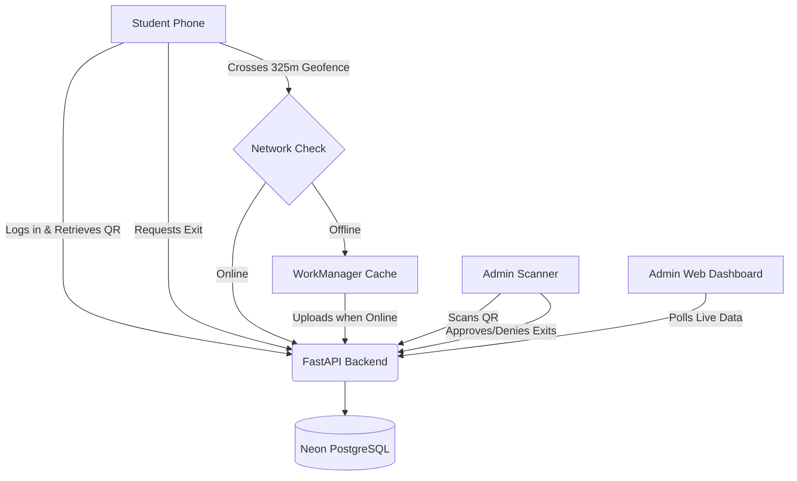

# KIWI Smart Attendance System
## Comprehensive Technical & Workflow Documentation

### 1. Project Overview & Problem Statement
Traditional collegiate attendance systems struggle with proxy check-ins, unmonitored exits, and manual tracking inefficiencies. The **KIWI Smart Attendance System** solves these issues for Bharati Vidyapeeth College of Engineering (BVCOE), Pune. The system ensures robust attendance logging, rigorous exit permissions, and reliable background geofencing to prevent proxy attendance and monitor off-campus activity.

### 2. What Was Built (Recent Implementations)
1. **Rebranding to KIWI:** The application shifted to a modern "KIWI" visual identity, adopting a sober and professional corporate UI.
2. **Attendance via Dynamic QR Code:** Face verification was swapped out for a highly optimized, daily-refreshed QR code check-in mechanism to prioritize speed and reliability on low-end devices.
3. **Exit Approval Workflow:** Integrated a dedicated workflow allowing students to request campus exits, which can be approved or denied by administrators.
4. **Offline-Resilient Geofencing:** Implemented background geofence services via Google Play Services and WorkManager. Even when a student crosses the campus boundary offline, the event is cached and uploaded once connectivity is restored.
5. **Corporate Web Portal & App:** Built a React-based single-file web admin portal (with PDF reporting functionality) and Kotlin Compose mobile applications.
6. **Backend Infrastructure Migration:** Scaled from local processing to a remote FastAPI Python backend deployed on Render, linked to an enterprise-grade Neon PostgreSQL database.

### 3. Core System Architecture
The system employs an API-driven architecture dividing concerns across four layers:

- **Frontend (Student):** Android App built with Kotlin and Jetpack Compose. Focuses on QR rendering, requesting exits, and the critical Geofencing background service.
- **Frontend (Admin):** Dual platforms. An Android App for on-the-go scanning and approval, and a Web React Portal (`index.html` served locally) for dashboard monitoring and bulk PDF exports.
- **Backend API:** Python FastAPI running in the cloud (Render), processing check-in deduplication, geofence alignment, and exit permissions.
- **Database Layer:** Neon PostgreSQL ensuring data reliability, relational integrity, and cross-platform syncing.

### 4. Workflow diagram

### 5. Detailed Component Logic
#### A. Attendance Check-In / Check-Out
- Students log into their Android app to view a dynamic QR code containing their tokenized ID and the current date.
- At the lecture hall, an Admin uses their Android App to scan the student`s QR.
- The system checks if it is the first scan of the day (`status="IN"`). A subsequent scan transitions the record to `status="COMPLETED"`. Duplicate scans are detected and rejected.

#### B. The Exit Request Workflow
- If a student wishes to leave campus, they submit a request with a valid `reason` via their app.
- The Admin app/web dashboard real-time queue catches this. The admin can `APPROVE` or `DENY` it.
- An exit is not formalized until the student physically leaves the campus.

#### C. Background Geofencing Alerts
- Upon student login, a `GeofenceManager` registers the BVCOE Pune geofence boundaries (radius 325m).
- When Google Play Services detect a boundary transition (`EXIT` or `RETURN`), a broadcast is sent to `GeofenceBroadcastReceiver`.
- The device securely queries the `GeofenceUploadWorker`. The server evaluates the transition against the user`s latest Exit Request status:
    - **Approved Request:** Logged as "Left campus after approval".
    - **Pending/Denied Request:** Flagged immediately as an UNAUTHORIZED EXIT, triggering dashboard alerts.
    - **Online/Offline Resilience:** Events missed due to poor network coverage are cached inside the Android Room Database/WorkManager and flushed to `/geofence-events` immediately upon reconnecting.

### 6. Database Schema Summary
- **Users**: Admin vs. Student roles. Retains profile structure (PRN, Roll, Division) and hashed credentials.
- **AttendanceRecord**: Daily logs linking `student_id`, `date`, `time_in`, and `time_out`.
- **ExitRequest**: Tracks `reason`, `status`, `resolved_by`, and the actual timestamps for physical geofence exit/return (`left_campus_at`, `returned_campus_at`).
- **GeofenceEvent**: Granular tracking table caching GPS coordinates, `accuracy_meters`, network payload types, and auto-computed `permission_status`.

### 7. Future Expansion Scope
The resilient backend built allows easy iterations towards SMS parental alerts by integrating a Twilio microservice, cross-building the app for iOS natively due to standard Rest API, or dynamically shrinking the geofence to the exact polygon edges rather than a 325m radius circle.
