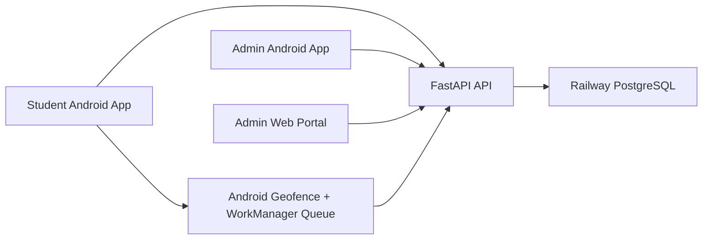

<div align="center">
  
  <h1>KIWI Smart Attendance</h1>
  <p><b>Cloud-first attendance, exit control, and geofence alerting for BVCOE Pune</b></p>

  
  
  
  
  
</div>

## Mission
KIWI is a production-ready smart attendance platform built around three things:

1. QR-based attendance for reliable classroom check-in and check-out.
2. campus geofencing for live movement awareness.
3. admin oversight through a cloud backend, Android admin app, and web dashboard.

The current campus boundary is tuned for:

- `Bharati Vidyapeeth (Deemed to be University) College of Engineering, Pune`
- Center: `18.458444, 73.855922`
- Source reference: `18°27'30.40"N 73°51'21.32"E`
- Active geofence radius: `325 meters`

---

## Live Stack
<details open>
<summary><b>Production topology</b></summary>



- Android app: Kotlin + Compose + WorkManager + Google Play geofencing
- Backend: FastAPI + SQLAlchemy + JWT auth
- Database: PostgreSQL on Railway, SQLite fallback for local work
- Admin web portal: React in a single HTML file
</details>

<details>
<summary><b>What is already solved</b></summary>

- Cloud backend is wired and can run independently of your laptop.
- Student attendance, exit requests, and geofence events are persisted server-side.
- Admin dashboards poll live attendance, exit decisions, and geofence alerts.
- Android now sends richer geofence events with location, distance, device identity, and network type.
</details>

---

## Trusted Admin Mode
<details open>
<summary><b>How admin access works now</b></summary>

- Students can log in from any network.
- Admin API access is restricted to trusted admin clients by default.
- The Android admin app identifies itself as `android-app`.
- The web portal identifies itself as `web-portal`.
- The admin Android app now shows a `Trusted Admin Device Key` on the home screen so you can lock admin access to your Vivo Y75 5G.
</details>

<details>
<summary><b>Recommended Railway environment variables</b></summary>

```env
ADMIN_ALLOWED_CLIENT_TYPES=android-app
ADMIN_ALLOWED_DEVICE_IDS=<paste-the-device-key-shown-inside-the-admin-android-app>
ADMIN_ALLOWED_NETWORKS=<optional-comma-separated-ip-or-cidr-list>
```

Recommended setup:

- Keep `ADMIN_ALLOWED_CLIENT_TYPES=android-app` to shift admin login to the phone.
- Add `ADMIN_ALLOWED_DEVICE_IDS` to bind admin access to the Vivo device.
- Add `ADMIN_ALLOWED_NETWORKS` only if you also want the web portal usable from one approved network.
</details>

<details>
<summary><b>Why device allowlisting is better than mobile IP locking</b></summary>

- Mobile carrier IPs can change.
- Android app device identity is far more stable for trusted-admin enforcement.
- Network allowlisting is still supported as an extra gate for portal access.
</details>

---

## Geofence Behavior
<details open>
<summary><b>What happens when a student leaves campus</b></summary>

- Android geofence detects `EXIT` or `RETURN`.
- Event is saved locally first.
- If the student has internet, the event is uploaded immediately.
- If the student is offline, WorkManager retries later.
- The backend links the event to the latest exit request, if any.
- Admin app and admin portal show the alert on the next refresh cycle.
</details>

<details>
<summary><b>What was fixed</b></summary>

- Corrected the Android geofence center to the BVCOE coordinates above.
- Increased the geofence radius to fit the real campus footprint instead of a tiny test circle.
- Added proper background-location gating so monitoring is not limited to foreground usage.
- Fixed the worker upload contract so queued geofence events hit a real backend endpoint.
- Added network type, approximate boundary distance, and device ID to stored geofence alerts.
- Added alert surfacing for fresh exit events in both admin interfaces.
- Added boot re-registration so student geofencing recovers after restart or app update.
</details>

<details>
<summary><b>Personal network / mobile data support</b></summary>

Students do not need to stay on college Wi-Fi. If a student leaves campus while on personal mobile data, the phone still:

- triggers the geofence exit
- stores the event locally first
- uploads it to the backend when connectivity is available
- makes it visible to admin through the portal or admin application
</details>

---

## Quick Start
<details open>
<summary><b>Run the admin portal</b></summary>

```powershell
.\start.ps1
```

The portal opens locally but talks to the cloud backend.
</details>

<details open>
<summary><b>Run the Android app</b></summary>

1. Open `frontend` in Android Studio.
2. Connect the physical Android device.
3. Grant:
   - fine location
   - background location
   - notifications
4. Press `Run`.
5. Log in as student or admin depending on the flow you want to test.
</details>

<details>
<summary><b>Admin phone setup checklist</b></summary>

1. Install and run the Android app on the Vivo Y75 5G.
2. Log in as admin from the phone.
3. Open the admin home screen and copy the `Trusted Admin Device Key`.
4. Add that value to `ADMIN_ALLOWED_DEVICE_IDS` in Railway.
5. Redeploy Railway.
6. Test admin login again from the Vivo phone and confirm the web portal is blocked unless its network is allowlisted.
</details>

---

## Project Map
<details>
<summary><b>Repository layout</b></summary>

```text
smartattendance/
├─ backend/              FastAPI API, auth, attendance, exit requests, geofence storage
├─ frontend/             Android app (student + admin)
├─ admin-portal/         React admin dashboard in a single HTML entry
├─ start.ps1             Quick portal launcher
└─ README.md             This file
```
</details>

<details>
<summary><b>Key files for the current flow</b></summary>

- `backend/app/routers/auth.py`
- `backend/app/routers/attendance.py`
- `backend/app/core/access_policy.py`
- `frontend/app/src/main/java/com/smartattendance/smartattendance/service/GeofenceManager.kt`
- `frontend/app/src/main/java/com/smartattendance/smartattendance/service/GeofenceBroadcastReceiver.kt`
- `frontend/app/src/main/java/com/smartattendance/smartattendance/service/GeofenceUploadWorker.kt`
- `frontend/app/src/main/java/com/smartattendance/smartattendance/ui/screens/AdminHomeScreen.kt`
- `admin-portal/index.html`
</details>

---

## Security Notes
<details open>
<summary><b>Important</b></summary>

- Do not publish real admin or student credentials in the README.
- Use Railway environment variables for admin access policy.
- The trusted-device pattern is intended to protect admin routes without restricting students.
- JWT auth still applies to all authenticated actions.
</details>

---

## Troubleshooting
<details>
<summary><b>Geofence still does not trigger</b></summary>

Check the phone for:

- location turned on
- background location granted
- battery optimization disabled for the app
- notifications allowed
- Google Play Services location working normally
</details>

<details>
<summary><b>Admin portal says access is restricted</b></summary>

That means the backend rejected the `web-portal` client. Either:

- continue using the Android admin app, or
- add the portal network to `ADMIN_ALLOWED_NETWORKS`
</details>

<details>
<summary><b>Student left campus but admin sees nothing</b></summary>

Verify:

- the student phone had geofence permissions
- the event reached `/attendance/geofence-events`
- the admin app or portal refreshed after the event
</details>

---

<div align="center">
  <b>Built for BVCOE Pune.</b><br/>
  <sub>Attendance, exit control, and geofence visibility in one stack.</sub>
</div>
