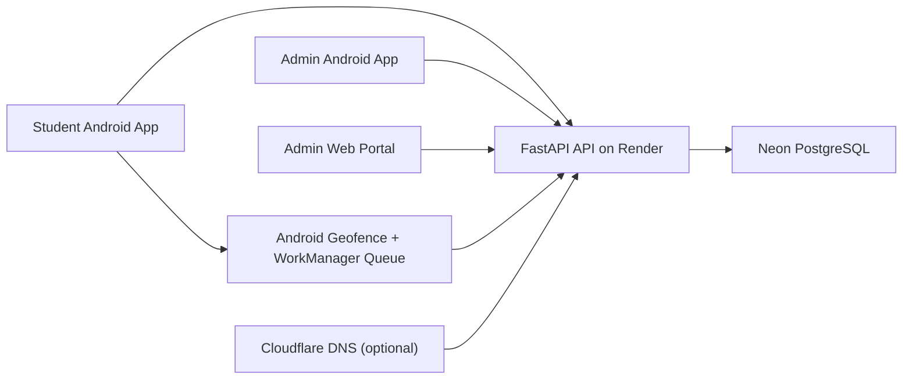

<div align="center">
  
  <h1>KIWI Smart Attendance</h1>
  <p><b>Render + Neon attendance, exit control, QR scanning, and geofence alerting for BVCOE Pune</b></p>

  
  
  
  
  
</div>

## Overview
KIWI is a cloud-backed smart attendance platform with four working parts:

1. Android QR attendance for daily check-in and check-out.
2. Student exit request workflow with admin approval and denial.
3. Live geofence exit and return alerts for students on any network, including mobile data.
4. Admin monitoring through both the Android admin app and the local web portal.

<details open>
<summary><b>Production architecture</b></summary>



- Backend host: Render
- Database: Neon PostgreSQL
- Mobile app: Kotlin + Compose + Retrofit + WorkManager + Play Services geofencing
- Admin portal: React in a single HTML file, served locally by `start.ps1`
</details>

<details>
<summary><b>Current production API</b></summary>

```text
https://kiwi-smart-attendance-api.onrender.com
```

Use this as the single backend URL until you later move to a custom Cloudflare domain.
</details>

## Campus Geofence
<details open>
<summary><b>BVCOE campus boundary</b></summary>

- Campus: `Bharati Vidyapeeth (Deemed to be University) College of Engineering, Pune`
- Center: `18.458444, 73.855922`
- Source reference: `18deg27'30.40"N 73deg51'21.32"E`
- Active radius: `325 meters`
</details>

<details>
<summary><b>How geofencing works now</b></summary>

- The student app registers a campus geofence after login.
- Exit and return transitions are captured through Google Play Services geofencing.
- Events are saved locally first.
- If the phone is offline, WorkManager retries the upload automatically.
- If the phone is on mobile data, the upload still goes to the same Render API.
- The backend stores the event in PostgreSQL and links it to the latest exit request when applicable.
- The admin Android app and admin portal both poll and surface recent geofence alerts.
</details>

<details>
<summary><b>What to grant on student phones</b></summary>

- Fine location
- Background location
- Notifications
- Battery optimization disabled for the app
</details>

## Admin Access Modes
<details open>
<summary><b>Default mode</b></summary>

All login is open by default.

- Students can log in from any network.
- Admins can log in from Android or web.
- No device or IP restriction is active until you set the `ADMIN_ALLOWED_*` variables in Render.
</details>

<details>
<summary><b>Recommended phone-only admin mode</b></summary>

If you want admin login to be limited to your Vivo Y75 5G while students stay open everywhere:

```env
ADMIN_ALLOWED_CLIENT_TYPES=android-app
ADMIN_ALLOWED_DEVICE_IDS=<trusted-device-key-from-the-admin-android-app>
ADMIN_ALLOWED_NETWORKS=
```

This keeps student access open while locking admin access to the Android admin app on the trusted phone.
</details>

## Quick Start
<details open>
<summary><b>Run the admin portal</b></summary>

```powershell
.\start.ps1
```

Open:

```text
http://localhost:8080
```

The portal is local, but all data comes from the Render backend.
</details>

<details open>
<summary><b>Run the Android app</b></summary>

1. Open [build.gradle.kts](/C:/Users/DELL/Desktop/smartattendance/frontend/app/build.gradle.kts) in Android Studio.
2. Connect a physical Android device.
3. Build and install the debug app.
4. Grant the required permissions.
5. Log in as student or admin.
</details>

<details>
<summary><b>Deploy or redeploy the backend</b></summary>

See [RENDER_SETUP.md](/C:/Users/DELL/Desktop/smartattendance/RENDER_SETUP.md) for the clean Render + Neon workflow.
</details>

## Key Files
<details open>
<summary><b>Main runtime files</b></summary>

- [main.py](/C:/Users/DELL/Desktop/smartattendance/backend/app/main.py)
- [auth.py](/C:/Users/DELL/Desktop/smartattendance/backend/app/routers/auth.py)
- [attendance.py](/C:/Users/DELL/Desktop/smartattendance/backend/app/routers/attendance.py)
- [access_policy.py](/C:/Users/DELL/Desktop/smartattendance/backend/app/core/access_policy.py)
- [ApiClient.kt](/C:/Users/DELL/Desktop/smartattendance/frontend/app/src/main/java/com/smartattendance/smartattendance/data/remote/ApiClient.kt)
- [GeofenceManager.kt](/C:/Users/DELL/Desktop/smartattendance/frontend/app/src/main/java/com/smartattendance/smartattendance/service/GeofenceManager.kt)
- [GeofenceBroadcastReceiver.kt](/C:/Users/DELL/Desktop/smartattendance/frontend/app/src/main/java/com/smartattendance/smartattendance/service/GeofenceBroadcastReceiver.kt)
- [GeofenceUploadWorker.kt](/C:/Users/DELL/Desktop/smartattendance/frontend/app/src/main/java/com/smartattendance/smartattendance/service/GeofenceUploadWorker.kt)
- [AdminHomeScreen.kt](/C:/Users/DELL/Desktop/smartattendance/frontend/app/src/main/java/com/smartattendance/smartattendance/ui/screens/AdminHomeScreen.kt)
- [StudentHomeScreen.kt](/C:/Users/DELL/Desktop/smartattendance/frontend/app/src/main/java/com/smartattendance/smartattendance/ui/screens/StudentHomeScreen.kt)
- [index.html](/C:/Users/DELL/Desktop/smartattendance/admin-portal/index.html)
- [render.yaml](/C:/Users/DELL/Desktop/smartattendance/render.yaml)
</details>

## Troubleshooting
<details>
<summary><b>Admin portal cannot log in</b></summary>

- Run the portal through `http://localhost:8080`, not `file:///...`.
- Confirm the Render backend URL is reachable.
- If admin restrictions are enabled, make sure `web-portal` is allowed.
</details>

<details>
<summary><b>Android geofence does not alert</b></summary>

- Confirm location services are on.
- Confirm background location is granted.
- Confirm the student account is logged in.
- Confirm the app is not battery-restricted.
- Confirm the backend is reachable from the phone's current network.
</details>

<details>
<summary><b>Students leave campus but admin sees nothing</b></summary>

- Verify the student phone recorded an `EXIT` event.
- Verify the phone later uploaded the queued event.
- Check [attendance.py](/C:/Users/DELL/Desktop/smartattendance/backend/app/routers/attendance.py) for the `geofence-events` endpoints.
- Refresh the admin app or portal after the event reaches the backend.
</details>

<div align="center">
  <b>Built for BVCOE Pune.</b><br/>
  <sub>Attendance, QR, exit control, and geofence visibility in one clean Render-based stack.</sub>
</div>
